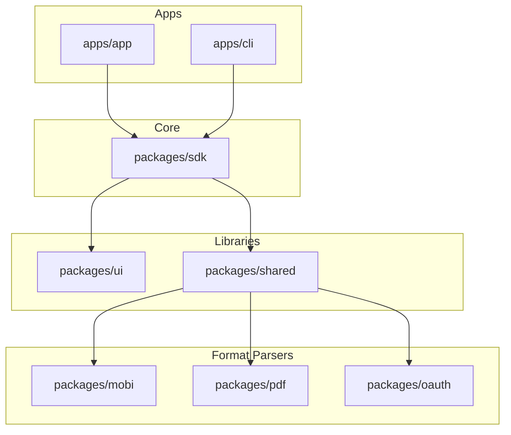
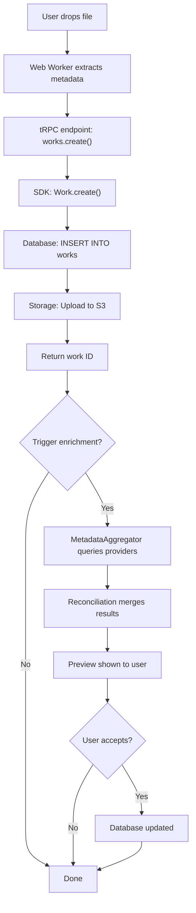
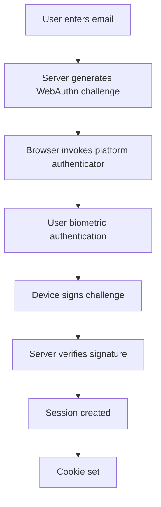

# Architecture for Contributors

This guide provides a contributor-focused overview of Colibri's architecture. For deployment architecture, see the [Architecture Overview](/setup/architecture).

## Navigating the Codebase

### Monorepo Organization

Colibri uses **Turborepo** with **pnpm workspaces** to manage multiple packages efficiently. Understanding this structure is key to contributing effectively.

```
colibri/
├── apps/
│   ├── app/          # Main SvelteKit web application
│   ├── cli/          # Command-line interface
│   └── docs/         # Documentation site (you're reading it!)
├── packages/
│   ├── sdk/          # Core SDK - database, metadata, storage
│   ├── ui/           # Reusable UI components
│   ├── shared/       # Shared utilities and configs
│   ├── mobi/         # MOBI ebook parser
│   ├── pdf/          # PDF utilities wrapper
│   ├── oauth/        # OAuth 2.0 server
│   ├── open-library-client/  # Open Library API client
│   └── languages/    # Language code utilities
├── supabase/
│   ├── migrations/   # Database schema migrations
│   └── schemas/      # Schema documentation
└── .claude/
    └── agents/       # Specialized AI agents for different domains
```

### Where to Make Changes

**Web UI or features** → `apps/app/src/`

- Routes: `apps/app/src/routes/`
- Components: `apps/app/src/lib/components/`
- tRPC API: `apps/app/src/lib/trpc/`

**CLI commands** → `apps/cli/src/commands/`

**Database operations** → `packages/sdk/src/resources/`

**Ebook parsing** → `packages/sdk/src/ebooks/`

**Metadata providers** → `packages/sdk/src/metadata/providers/`

**UI components** → `packages/ui/src/lib/ui/`

**Database schema** → `supabase/schemas/` or `supabase/migrations/`

## Package Dependencies

Understanding the dependency flow helps you avoid circular dependencies and understand impact:



**Key rules:**

- Apps depend on packages, never the reverse
- `packages/sdk` is the core - most packages depend on it
- `packages/shared` provides utilities to everyone
- Avoid creating circular dependencies between packages

## Tech Stack Deep Dive

### Frontend Architecture

**Svelte 5 with Runes**

Colibri uses the latest Svelte 5 with its new reactivity system (runes):

```svelte
<script lang="ts">
  // New runes-based reactivity
  let count = $state(0);
  let doubled = $derived(count * 2);

  function increment() {
    count++;
  }
</script>

<button onclick={increment}>
  Count: {count} (doubled: {doubled})
</button>
```

**SvelteKit Routing**

Routes use SvelteKit's file-based routing:

- `+page.svelte` - Page component
- `+page.ts` - Client-side load function
- `+page.server.ts` - Server-side load function
- `+layout.svelte` - Layout wrapper
- `+server.ts` - API endpoints

**tRPC Integration**

Type-safe API calls without code generation:

```typescript
// Server: apps/app/src/lib/trpc/routes/works.ts
export const worksRouter = router({
  list: publicProcedure
    .input(z.object({ limit: z.number().optional() }))
    .query(async ({ input }) => {
      return await Work.list({ limit: input.limit });
    }),
});

// Client: anywhere in the app
const works = await trpc.works.list.query({ limit: 10 });
// ✓ Fully typed, no manual type definitions needed
```

### Backend Architecture

**Kysely Query Builder**

Type-safe SQL queries generated from database schema:

```typescript
import { db } from "@colibri-hq/sdk";

// Fully typed query
const works = await db
  .selectFrom("works")
  .select(["id", "title", "subtitle"])
  .where("published_date", ">", new Date("2020-01-01"))
  .orderBy("title", "asc")
  .execute();
// ✓ TypeScript knows the exact shape of 'works'
```

**Resource Pattern**

Domain models follow a consistent pattern:

```typescript
// packages/sdk/src/resources/work.ts
export class Work {
  static async find(id: string): Promise<Work | null> {}
  static async list(options?: ListOptions): Promise<Work[]> {}
  static async create(data: WorkData): Promise<Work> {}

  async update(data: Partial<WorkData>): Promise<void> {}
  async delete(): Promise<void> {}
}
```

### Database Schema

**PostgreSQL with RLS**

Row-level security ensures data isolation:

```sql
-- Example from supabase/schemas/03_works.sql
CREATE POLICY "Users can view their own works"
  ON works FOR SELECT
  USING (auth.uid() = user_id);
```

**Type Generation**

After schema changes, regenerate types:

```bash
cd packages/sdk
pnpm types
# Generates src/schema.d.ts from live database
```

**Migration Workflow**

1. Create migration: `pnpx supabase migration new feature_name`
2. Write SQL in `supabase/migrations/YYYYMMDDHHMMSS_feature_name.sql`
3. Test locally: `pnpx supabase db reset`
4. Generate types: `cd packages/sdk && pnpm types`
5. Commit both migration and generated types

### Storage Architecture

**S3-Compatible Object Storage**

All files use S3-compatible storage (MinIO locally, AWS S3/R2/etc in production):

```typescript
import { storage } from "@colibri-hq/sdk/storage";

// Upload file
await storage.uploadFile("covers", "work-123/original.jpg", fileBuffer);

// Get signed URL
const url = await storage.getSignedUrl("covers", "work-123/original.jpg");

// Delete file
await storage.deleteFile("covers", "work-123/original.jpg");
```

**Buckets:**

- `covers` - Book cover images
- `assets` - Ebook files (EPUB, MOBI, PDF)
- `imports` - Temporary upload storage

## Key Architectural Patterns

### 1. Type-Safe Everything

Colibri prioritizes type safety:

- Database types generated from schema
- tRPC provides end-to-end type safety
- Svelte components use TypeScript
- Strict TypeScript configuration

**As a contributor:** Write types first, implement second. Type errors should guide development.

### 2. Progressive Enhancement

Web app works with JavaScript disabled (where possible):

- Forms use native HTML form submission
- Server-side rendering for initial content
- JavaScript enhances interactivity

**As a contributor:** Test features with JavaScript disabled when adding forms or navigation.

### 3. Resource-Oriented Design

Domain models (Work, Creator, Publisher, etc.) encapsulate business logic:

```typescript
// ✓ Good: Business logic in resource
class Work {
  async addToCollection(collectionId: string) {
    // Validation, permission checks, etc.
  }
}

// ✗ Avoid: Business logic in API routes
router.addWorkToCollection(workId, collectionId) {
  // Logic here makes testing harder
}
```

### 4. Metadata Provider System

Extensible metadata providers follow a common interface:

```typescript
interface MetadataProvider {
  name: string;
  search(query: SearchQuery): Promise<Metadata[]>;
  getByIdentifier(type: string, value: string): Promise<Metadata | null>;
}
```

**To add a provider:**

1. Create file in `packages/sdk/src/metadata/providers/`
2. Implement the `MetadataProvider` interface
3. Add tests in `.test.ts` file
4. Register in `packages/sdk/src/metadata/providers/index.ts`

### 5. Worker-Based Processing

Heavy computations run in Web Workers:

```typescript
// apps/app/src/lib/workers/upload.worker.ts
// Runs in separate thread, doesn't block UI
self.addEventListener("message", async (event) => {
  const { file } = event.data;
  const metadata = await parseEbook(file);
  postMessage({ metadata });
});
```

## Data Flow Examples

### Uploading and Enriching a Book



### Authentication Flow



## Testing Strategy

### Unit Tests (Vitest)

Test pure functions and isolated logic:

```typescript
// packages/sdk/src/metadata/utils/normalization.test.ts
import { describe, it, expect } from "vitest";
import { normalizeISBN } from "./normalization";

describe("normalizeISBN", () => {
  it("removes hyphens from ISBN-13", () => {
    expect(normalizeISBN("978-0-14-028329-7")).toBe("9780140283297");
  });
});
```

### Integration Tests (Vitest + Database)

Test SDK resources with real database:

```typescript
// packages/sdk/src/resources/work.test.ts
import { describe, it, expect, beforeEach } from "vitest";
import { db } from "../database";
import { Work } from "./work";

beforeEach(async () => {
  // Reset test database
  await db.deleteFrom("works").execute();
});

it("creates a work", async () => {
  const work = await Work.create({ title: "Test Book" });
  expect(work.title).toBe("Test Book");
});
```

### E2E Tests (Playwright)

Test complete user flows in the web app:

```typescript
// apps/app/tests/upload-book.spec.ts
import { test, expect } from "@playwright/test";

test("user can upload a book", async ({ page }) => {
  await page.goto("/");
  await page.click("text=Upload");
  await page.setInputFiles("input[type=file]", "test-book.epub");
  await expect(page.locator("text=Book uploaded")).toBeVisible();
});
```

### Where to Add Tests

- **Unit tests**: Next to the code being tested (`my-module.test.ts`)
- **SDK integration tests**: `packages/sdk/src/**/*.test.ts`
- **E2E tests**: `apps/app/tests/**/*.spec.ts`
- **CLI tests**: `apps/cli/test/**/*.test.ts`

## Code Organization Best Practices

### File Naming

- Components: `PascalCase.svelte`
- Utilities: `kebab-case.ts`
- Tests: `same-name.test.ts`
- Types: `types.ts` or inline with code

### Import Order

ESLint enforces this order:

1. External packages
2. Internal packages (`@colibri-hq/*`)
3. Relative imports
4. Type imports

```typescript
// ✓ Good
import { describe, it } from "vitest";
import { db } from "@colibri-hq/sdk";
import { Work } from "./work";
import type { WorkData } from "./types";
```

### Component Structure

```svelte
<script lang="ts">
  // 1. Imports
  import { Button } from '@colibri-hq/ui';
  import type { Work } from '@colibri-hq/sdk';

  // 2. Props
  interface Props {
    work: Work;
  }
  let { work }: Props = $props();

  // 3. State
  let isLoading = $state(false);

  // 4. Derived state
  let hasMetadata = $derived(work.metadata !== null);

  // 5. Functions
  async function handleSubmit() {
    isLoading = true;
    // ...
  }
</script>

<!-- 6. Template -->
<div class="container">
  <h1>{work.title}</h1>
  <Button onclick={handleSubmit}>Save</Button>
</div>

<!-- 7. Styles (if not using Tailwind) -->
<style>
  .container {
    padding: 1rem;
  }
</style>
```

## Performance Considerations

### Database Queries

**Use select() to limit columns:**

```typescript
// ✓ Good: Only select needed columns
const works = await db.selectFrom("works").select(["id", "title"]).execute();

// ✗ Avoid: Selecting all columns
const works = await db.selectFrom("works").selectAll().execute();
```

**Use joins instead of N+1 queries:**

```typescript
// ✓ Good: Single query with join
const worksWithAuthors = await db
  .selectFrom("works")
  .innerJoin("contributions", "works.id", "contributions.work_id")
  .innerJoin("creators", "contributions.creator_id", "creators.id")
  .selectAll()
  .execute();

// ✗ Avoid: N+1 queries
const works = await Work.list();
for (const work of works) {
  work.authors = await work.getAuthors(); // Separate query per work
}
```

### Frontend Performance

- Use `$derived` instead of `$: reactive statements`
- Lazy load heavy components
- Use `{#key}` blocks to force re-renders only when needed
- Debounce search inputs

### Metadata Providers

- Providers run in parallel (Promise.allSettled)
- Implement timeouts to avoid slow providers blocking
- Cache results when possible
- Rate limit API calls

## Common Gotchas

### 1. Database Type Generation

After changing schema, always regenerate types:

```bash
cd packages/sdk && pnpm types
```

Otherwise TypeScript won't know about your changes.

### 2. pnpm Workspace Protocol

When importing local packages, use workspace protocol in `package.json`:

```json
{ "dependencies": { "@colibri-hq/sdk": "workspace:*" } }
```

### 3. Environment Variables

- Client-side variables must be prefixed with `PUBLIC_`
- Update `.env.example` when adding new variables
- Document in the relevant docs page

### 4. Svelte 5 Migration

Old Svelte 4 patterns don't work:

```svelte
<!-- ✗ Svelte 4 (deprecated) -->
<script>
  export let count = 0;
  $: doubled = count * 2;
</script>

<!-- ✓ Svelte 5 (current) -->
<script lang="ts">
  let { count = 0 } = $props();
  let doubled = $derived(count * 2);
</script>
```

## Specialized Agents

Colibri has specialized AI agents in `.claude/agents/` for different domains. When contributing to specific areas, these agents have deep context:

| Domain         | Agent                     | Use For                                    |
| -------------- | ------------------------- | ------------------------------------------ |
| Database       | `database-expert`         | Schema design, migrations, Kysely queries  |
| SDK            | `sdk-expert`              | Core SDK functionality, resources, storage |
| Web App        | `web-app-expert`          | SvelteKit routes, tRPC, authentication     |
| UI             | `ui-components-expert`    | Component design, accessibility, Storybook |
| CLI            | `cli-expert`              | oclif commands, terminal output            |
| Metadata       | `metadata-expert`         | Providers, reconciliation, enrichment      |
| Ebooks         | `ebook-processing-expert` | EPUB/MOBI/PDF parsing                      |
| Infrastructure | `infrastructure-expert`   | OAuth, configs, deployment                 |

**Using agents:** Reference the agent name in issues, PRs, or when asking for help to get domain-specific guidance.

## Next Steps

- Read [Contributing Guidelines](/getting-started/contributing/guidelines) for code standards and PR process
- Explore [Development Setup](/getting-started/contributing/development) to get your environment running
- Check [Good First Issues](https://github.com/colibri-hq/colibri/labels/good%20first%20issue) to find beginner-friendly tasks
- Join [GitHub Discussions](https://github.com/colibri-hq/colibri/discussions) to ask questions

## Getting Help

Understanding the architecture takes time. Don't hesitate to ask for help:

- **GitHub Discussions**: General questions
- **GitHub Issues**: Bug reports, feature requests
- **Code comments**: When in doubt, ask in a PR
- **Documentation**: If something is unclear, please suggest improvements!
