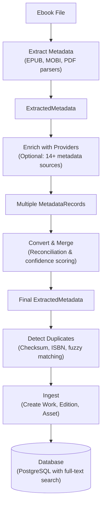

# Ingestion SDK

The Ingestion SDK provides a complete pipeline for importing ebooks into Colibri. It handles metadata extraction, enrichment from external providers, duplicate detection, and database storage with automatic fuzzy matching to prevent duplicates.

## Installation

```bash
npm install @colibri-hq/sdk
# or
pnpm add @colibri-hq/sdk
```

## Architecture Overview

The ingestion pipeline follows this flow:



---

## Quick Start

### Basic Ingestion

Ingest an ebook without enrichment:

```typescript
import { ingestWork } from "@colibri-hq/sdk/ingestion";
import { parseEpub } from "@colibri-hq/sdk/ebooks";

// Extract metadata from file
const metadata = await parseEpub(fileBuffer);

// Ingest into database
const result = await ingestWork(database, {
  file: fileBuffer,
  filename: "gatsby.epub",
  metadata: metadata,
  userId: "user-123",
});

console.log("Created work:", result.work.id);
console.log("Created edition:", result.edition.id);
console.log("Created asset:", result.asset.id);
```

### Ingestion with Enrichment

Automatically fetch additional metadata from external sources:

```typescript
import { ingestWork } from "@colibri-hq/sdk/ingestion";
import { globalProviderRegistry } from "@colibri-hq/sdk/metadata";

const result = await ingestWork(database, {
  file: fileBuffer,
  filename: "gatsby.epub",
  metadata: extractedMetadata,
  userId: "user-123",
  enrich: true, // Enable enrichment
  enrichProviders: globalProviderRegistry.getEnabledProviders(),
});

if (result.enrichmentResults) {
  console.log("Sources used:", result.enrichmentResults.sources);
  console.log("Confidence:", result.enrichmentResults.confidence);
}
```

---

## Metadata Extraction

Extract metadata from different ebook formats:

### EPUB Files

```typescript
import { parseEpub } from "@colibri-hq/sdk/ebooks";

const metadata = await parseEpub(fileBuffer);

console.log("Title:", metadata.title);
console.log(
  "Authors:",
  metadata.contributors?.filter((c) => c.roles.includes("aut")),
);
console.log("Cover:", metadata.coverImage);
console.log("ISBN:", metadata.identifiers?.find((i) => i.type === "isbn")?.value);
```

**Extracted data:**

- Title, subtitle
- Contributors (authors, editors, translators with MARC roles)
- Publisher
- Publication date
- Language (ISO 639-1)
- Identifiers (ISBN, DOI, etc.)
- Synopsis/description
- Subjects/tags
- Cover image
- Series information

### MOBI Files

```typescript
import { parseMobi } from "@colibri-hq/sdk/ebooks";

const metadata = await parseMobi(fileBuffer);

console.log("Title:", metadata.title);
console.log("Creator:", metadata.creator);
console.log("ASIN:", metadata.asin);
console.log("Cover:", metadata.coverImage);
```

**Extracted data:**

- Title
- Creator (author)
- Publisher
- ASIN (Amazon identifier)
- ISBN
- Language
- Cover image

### PDF Files

```typescript
import { parsePdf } from "@colibri-hq/sdk/ebooks";

const metadata = await parsePdf(fileBuffer);

console.log("Title:", metadata.title);
console.log("Author:", metadata.author);
console.log("Pages:", metadata.pageCount);
```

**Extracted data:**

- Title
- Author
- Subject
- Keywords
- Page count
- Creation/modification dates

---

## Metadata Enrichment

Enrich extracted metadata with data from 14+ external providers.

### Basic Enrichment

```typescript
import { enrichMetadata } from "@colibri-hq/sdk/ingestion";
import { globalProviderRegistry } from "@colibri-hq/sdk/metadata";

const ebookMetadata = {
  title: "The Great Gatsby",
  contributors: [{ name: "F. Scott Fitzgerald", roles: ["aut"] }],
  identifiers: [{ type: "isbn", value: "9780743273565" }],
};

// Get all enabled providers
const providers = globalProviderRegistry.getEnabledProviders();

// Enrich metadata
const result = await enrichMetadata(ebookMetadata, providers, {
  preferredLanguage: "en",
  strategy: "merge-all", // Merge all provider results
  timeout: 30000, // 30 second timeout
});

console.log("Enriched:", result.enriched);
console.log("Sources:", result.sources); // ['WikiData', 'OpenLibrary', 'LoC']
console.log("Confidence:", result.confidence); // 0.92
```

### Selective Provider Enrichment

Use specific providers for targeted enrichment:

```typescript
import {
  OpenLibraryMetadataProvider,
  WikiDataMetadataProvider,
  LibraryOfCongressMetadataProvider,
} from "@colibri-hq/sdk/metadata";

const providers = [
  new OpenLibraryMetadataProvider(),
  new WikiDataMetadataProvider(),
  new LibraryOfCongressMetadataProvider(),
];

const result = await enrichMetadata(ebookMetadata, providers);
```

### Search Strategies

Different search criteria yield different confidence levels:

**Best for ISBN (0.90-0.98 confidence):**

- Strategy: Parallel
- Providers: WikiData + Library of Congress
- Speed: Fast (1-2 seconds)

**Best for Title + Author (0.80-0.95 confidence):**

- Strategy: Parallel
- Providers: WikiData + LoC + Open Library
- Speed: Moderate (2-4 seconds)

**Best for Title only (0.70-0.85 confidence):**

- Strategy: Sequential
- Providers: Open Library → WikiData → LoC
- Speed: Slower (4-8 seconds)

---

## Duplicate Detection

The ingestion system automatically detects duplicates using multiple strategies.

### Detection Methods

#### 1. Exact Asset Match

Compares file checksums (SHA-256):

```typescript
import { detectDuplicates } from "@colibri-hq/sdk/ingestion";

const duplicates = await detectDuplicates(database, {
  checksum: "sha256-hash-of-file",
  metadata: extractedMetadata,
});

if (duplicates.exactMatch) {
  console.log("Identical file already exists!");
  console.log("Confidence:", duplicates.exactMatch.confidence); // 1.0
}
```

#### 2. ISBN Match

Compares ISBN-10 or ISBN-13:

```typescript
const duplicates = await detectDuplicates(database, {
  metadata: { identifiers: [{ type: "isbn", value: "9780743273565" }] },
});

if (duplicates.isbnMatches.length > 0) {
  console.log("Same ISBN found:", duplicates.isbnMatches);
  // Could be different editions (hardcover vs paperback)
}
```

#### 3. Fuzzy Title/Author Match

Uses Levenshtein distance and PostgreSQL trigram similarity:

```typescript
const duplicates = await detectDuplicates(database, {
  metadata: {
    title: "The Great Gatsby",
    contributors: [{ name: "F Scott Fitzgerald", roles: ["aut"] }],
  },
});

for (const match of duplicates.fuzzyMatches) {
  console.log(`Title similarity: ${match.titleSimilarity}`);
  console.log(`Author similarity: ${match.authorSimilarity}`);
  console.log(`Overall confidence: ${match.confidence}`);
}
```

### Duplicate Handling Strategies

Configure how to handle duplicates during ingestion:

```typescript
const result = await ingestWork(database, {
  file: fileBuffer,
  metadata: extractedMetadata,
  userId: "user-123",
  onDuplicateWork: "prompt", // Options: 'skip' | 'replace' | 'prompt'
  onDuplicateEdition: "add-edition", // Add as new edition of existing work
  onDuplicateAsset: "skip", // Skip if exact file exists
});

if (result.status === "needs-confirmation") {
  console.log("Duplicate found:", result.duplicateInfo);
  // Display confirmation dialog to user
}
```

---

## Normalization

The SDK automatically normalizes names to prevent duplicates and improve matching.

### Creator Name Normalization

Handles initials, titles, suffixes, and punctuation:

```typescript
import { normalizeCreatorName } from "@colibri-hq/sdk/ingestion";

normalizeCreatorName("J.K. Rowling"); // "jk rowling"
normalizeCreatorName("J. K. Rowling"); // "jk rowling"
normalizeCreatorName("Rowling, J.K."); // "jk rowling"
normalizeCreatorName("Dr. John Smith"); // "john smith"
normalizeCreatorName("Martin Luther King Jr."); // "martin luther king"
normalizeCreatorName("José García"); // "jose garcia"
```

**Supported transformations:**

- Titles: Dr, Prof, Sir, Dame, Lord, Lady, Rev, Father, Mother, Brother, Sister, Saint, St, Pope
- Suffixes: Jr, Sr, Junior, Senior, I-XV (Roman numerals), PhD, MD, Esq
- Accents and diacritics normalized to ASCII
- Apostrophes removed (O'Brien → obrien)
- Hyphens preserved in hyphenated names

### Publisher Name Normalization

Removes business suffixes and common words:

```typescript
import { normalizePublisherName } from "@colibri-hq/sdk/ingestion";

normalizePublisherName("Penguin Books Ltd."); // "penguin"
normalizePublisherName("The Penguin Press"); // "penguin"
normalizePublisherName("O'Reilly Media"); // "oreilly media"
normalizePublisherName("McGraw-Hill"); // "mcgraw-hill"
```

**Supported transformations:**

- Business suffixes: Ltd, LLC, Inc, Corp, Co, Company
- Publishing words: Publishing, Publishers, Book(s), Press, Group
- Geographic terms: International, Worldwide
- Parentheticals removed (e.g., "Penguin (US)" → "penguin")

### Fuzzy Matching

Find similar creators or publishers in the database:

```typescript
import { findSimilarCreators, findSimilarPublishers } from "@colibri-hq/sdk";

// Find creators with similar names (default threshold: 70%)
const similar = await findSimilarCreators(database, "J. K. Rowling", 0.7);
// Returns: [{ creator: { name: "J.K. Rowling", ... }, similarity: 0.92 }]

// Find publishers with similar names
const matches = await findSimilarPublishers(database, "Penguin Books", 0.7);
// Returns: [{ publisher: { name: "Penguin", ... }, similarity: 0.87 }]
```

During ingestion, fuzzy matching is applied automatically to prevent duplicate creators and publishers.

---

## Confidence Scoring

Confidence scores indicate the reliability of enriched metadata.

### Confidence Tiers

| Range     | Tier        | Meaning                                              |
| --------- | ----------- | ---------------------------------------------------- |
| 0.95-1.00 | Exceptional | Very high confidence, multiple authoritative sources |
| 0.90-0.95 | Strong      | High confidence, reliable data                       |
| 0.70-0.90 | Good        | Good confidence, likely accurate                     |
| 0.50-0.70 | Moderate    | Moderate confidence, may need verification           |
| 0.30-0.50 | Weak        | Low confidence, verification recommended             |
| 0.00-0.30 | Poor        | Very low confidence, likely unreliable               |

### Confidence Calculation

Confidence scores are calculated based on:

1. **Base Confidence**: Provider's initial confidence (0.5-0.9)
2. **Source Count Boost**: +0.05 per additional source (max +0.15)
3. **Agreement Boost**: +0.10 when sources agree on values
4. **Reliability Boost**: +0.08 for high-quality providers
5. **Disagreement Penalty**: -0.10 to -0.20 for conflicting data

**Example:**

```
WikiData alone: 0.90
+ LoC agreeing: 0.95 (+0.05 source boost)
+ OpenLib agreeing: 0.98 (+0.03 source boost, +0.05 agreement boost)
```

---

## Advanced Usage

### Conflict Resolution

Handle conflicting metadata from different providers:

```typescript
import { resolveConflict } from "@colibri-hq/sdk/ingestion";

// Multiple providers return different publication dates
const allRecords = [
  { ...wikidataRecord, publicationDate: new Date("2020-01-15") },
  { ...locRecord, publicationDate: new Date("2020-01-01") },
  { ...openlibRecord, publicationDate: new Date("2019-12-31") },
];

// Resolve conflict
const resolution = resolveConflict(allRecords, "publicationDate", (date) =>
  date.getFullYear().toString(),
);

if (resolution.hasConflict) {
  console.log("Conflict detected!");
  console.log("Chosen value:", resolution.value);
  console.log("Alternatives:", resolution.alternatives);
}
```

### Series Detection

Automatically detect and create series:

```typescript
import { findOrCreateSeries, addWorkToSeries } from "@colibri-hq/sdk";

// Extract series from metadata
if (metadata.series) {
  const series = await findOrCreateSeries(database, metadata.series.name, {
    language: metadata.language || "en",
    userId: userId,
  });

  await addWorkToSeries(database, workId, series.id, metadata.series.position);
}
```

### Tag Extraction

Extract and link tags from subjects:

```typescript
import { findOrCreateTags, addTagsToWork } from "@colibri-hq/sdk";

// Extract subjects from metadata
const subjects = metadata.subjects || [];

// BISAC subjects are automatically parsed
// Input:  "FICTION / Romance / Historical / Scottish"
// Output: ["fiction", "romance", "historical", "scottish"]

const tags = await findOrCreateTags(database, subjects, { userId });
await addTagsToWork(
  database,
  workId,
  tags.map(({ id }) => id),
);
```

### Custom Metadata Conversion

Convert provider metadata to ingestion format:

```typescript
import { convertToExtractedMetadata, mergeMetadataRecords } from "@colibri-hq/sdk/ingestion";

// Query providers manually
const wikidata = new WikiDataMetadataProvider();
const openlib = new OpenLibraryMetadataProvider();

const [wikidataResults, openlibResults] = await Promise.all([
  wikidata.searchByISBN("9780743273565"),
  openlib.searchByISBN("9780743273565"),
]);

// Merge results
const merged = mergeMetadataRecords([...wikidataResults, ...openlibResults]);

console.log("Merged metadata:", merged);
```

---

## Error Handling

The enrichment system handles errors gracefully:

### Provider Failures

```typescript
// Provider failures don't stop enrichment
const result = await enrichMetadata(metadata, providers);
// If WikiData fails, other providers still run
// If all providers fail, returns empty enrichment

console.log("Errors:", result.errors);
// Map of provider name to error
```

### Ingestion Failures

```typescript
// Ingestion continues even if enrichment fails
try {
  const result = await ingestWork(database, {
    file,
    metadata,
    enrich: true, // Enrichment is best-effort
  });
} catch (error) {
  console.error("Ingestion failed:", error);
  // Work is created with ebook metadata even if providers are unavailable
}
```

---

## Performance Considerations

### Caching

Enable provider caching to reduce API calls:

```typescript
import { CacheableMetadataProvider } from "@colibri-hq/sdk/metadata";

const cached = new CacheableMetadataProvider(provider, {
  maxSize: 1000,
  defaultTtl: 300000, // 5 minutes
});
```

### Rate Limiting

Providers automatically handle rate limiting:

- **WikiData**: 60 requests/min, 1s delay
- **Library of Congress**: 30 requests/min, 2s delay
- **Open Library**: 100 requests/min, 200ms delay

### Timeouts

Set appropriate timeouts to prevent hanging:

```typescript
const result = await enrichMetadata(metadata, providers, {
  timeout: 30000, // 30 seconds total
});
```

### Parallel vs Sequential

- **Parallel**: Faster, use for ISBN or Title+Author searches
- **Sequential**: Slower but more reliable, use for title-only searches

---

## Database Schema

The ingestion system creates these entities:

### Work

The abstract book entity:

```typescript
interface Work {
  id: string;
  title: string;
  titleSortKey: string; // For alphabetical sorting
  synopsis?: string;
  language?: string;
  datePublished?: Date;
  createdAt: Date;
  updatedAt: Date;
}
```

### Edition

A specific published edition of a work:

```typescript
interface Edition {
  id: string;
  workId: string;
  title?: string; // Edition-specific title
  publishedDate?: Date;
  publisher?: string;
  numberOfPages?: number;
  format?: string; // 'epub' | 'mobi' | 'pdf'
  createdAt: Date;
}
```

### Asset

The physical ebook file:

```typescript
interface Asset {
  id: string;
  editionId: string;
  filename: string;
  mimetype: string;
  checksum: string; // SHA-256
  size: number;
  storageKey: string; // S3 key
  createdAt: Date;
}
```

### Relationships

```
Work ─┬─ Edition ── Asset
      ├─ Contribution ── Creator
      ├─ CollectionItem ── Collection
      ├─ WorkTag ── Tag
      ├─ SeriesItem ── Series
      └─ Comment
```

---

## TypeScript Support

The SDK is fully typed:

```typescript
import type {
  ExtractedMetadata,
  IngestWorkOptions,
  IngestWorkResult,
  DuplicateCheckResult,
  EnrichmentResult,
} from "@colibri-hq/sdk/ingestion";
```

---

## Complete Example

Full ingestion pipeline with enrichment and duplicate handling:

```typescript
import { ingestWork, detectDuplicates } from "@colibri-hq/sdk/ingestion";
import { parseEpub } from "@colibri-hq/sdk/ebooks";
import { globalProviderRegistry } from "@colibri-hq/sdk/metadata";

async function importEbook(file: File, userId: string) {
  // 1. Extract metadata from file
  const fileBuffer = await file.arrayBuffer();
  const metadata = await parseEpub(fileBuffer);

  console.log("Extracted:", metadata.title);

  // 2. Check for duplicates
  const duplicates = await detectDuplicates(database, {
    metadata,
    checksum: await calculateChecksum(fileBuffer),
  });

  if (duplicates.exactMatch) {
    console.log("File already exists, skipping");
    return { status: "skipped", reason: "duplicate-file" };
  }

  // 3. Ingest with enrichment
  const providers = globalProviderRegistry.getEnabledProviders();

  const result = await ingestWork(database, {
    file: fileBuffer,
    filename: file.name,
    metadata,
    userId,
    enrich: true,
    enrichProviders: providers,
    onDuplicateWork: "prompt",
    onDuplicateEdition: "add-edition",
  });

  if (result.status === "needs-confirmation") {
    // Display confirmation dialog
    return result;
  }

  console.log("Imported:", result.work.title);
  console.log("Confidence:", result.enrichmentResults?.confidence);

  return result;
}
```

---

## Related Documentation

- [Metadata SDK](/packages/sdk/metadata) - Metadata provider system
- [SDK Overview](/packages/sdk) - Core SDK features
- [MOBI Parser](/packages/mobi) - MOBI format details
