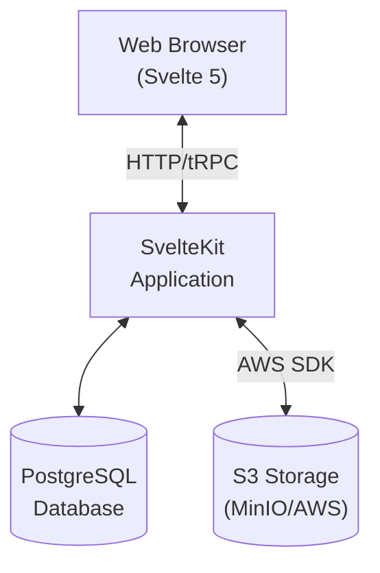
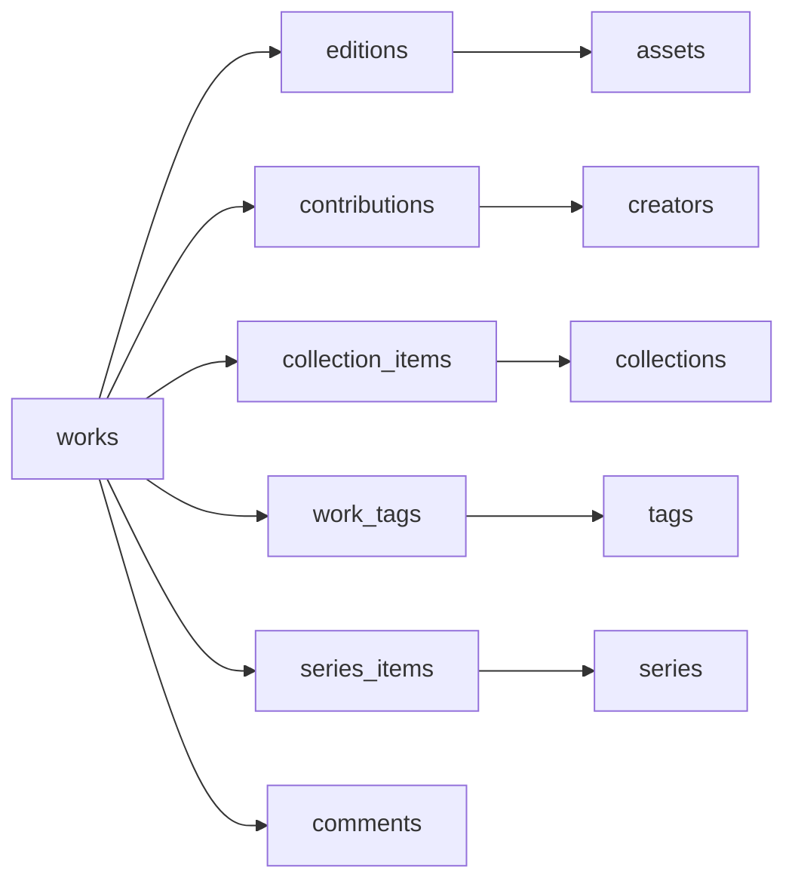

# Architecture Overview

Colibri is built as a modern, self-hosted web application with a focus on flexibility, type safety, and developer experience.

## High-Level Architecture



## Core Technologies

### Frontend

- **Svelte 5**: Modern reactive UI framework with runes
- **SvelteKit**: Full-stack framework with SSR and routing
- **Tailwind CSS 4**: Utility-first CSS framework
- **bits-ui**: Accessible component primitives
- **tRPC Client**: Type-safe API client

### Backend

- **Node.js 18+**: Runtime environment
- **tRPC**: Type-safe RPC framework
- **Kysely**: Type-safe SQL query builder
- **PostgreSQL 15+**: Primary database
- **AWS SDK**: S3-compatible storage client

### Infrastructure

- **Supabase**: PostgreSQL hosting with additional features
- **MinIO/S3**: Object storage for files
- **Docker**: Containerization for easy deployment

## Monorepo Structure

Colibri uses Turborepo and pnpm workspaces for efficient monorepo management.

### Applications

**`apps/app`** - Main web application

- SvelteKit routes and pages
- tRPC API router
- Client-side components
- Authentication flows

**`apps/cli`** - Command-line interface

- oclif-based CLI framework
- Topic-based command structure
- Direct SDK integration

**`apps/docs`** - Documentation site

- Markdown-based content
- SvelteKit static site generation

### Packages

**`packages/sdk`** - Core SDK

- Database operations (Kysely)
- Ebook parsing (EPUB, MOBI, PDF)
- Metadata providers (14+ sources)
- Storage abstraction
- Resource models

**`packages/ui`** - UI component library

- Reusable Svelte components
- Storybook documentation
- Accessibility-first design

**`packages/shared`** - Shared utilities

- Image processing
- blurhash generation
- XML/HTML parsing
- ESLint/Prettier configs

**`packages/mobi`** - MOBI parser

- Low-level MOBI format parsing
- Metadata extraction
- Cover image extraction

**`packages/pdf`** - PDF utilities

- pdf.js wrapper
- Conditional exports for node/browser

**`packages/oauth`** - OAuth 2.0 server

- Authorization server implementation
- Device authorization flow
- Client credentials flow

**`packages/open-library-client`** - Open Library client

- API wrapper for Open Library
- Search and metadata retrieval

**`packages/languages`** - Language utilities

- ISO 639 language code support
- Language name resolution

## Data Flow

### Uploading a Book

1. User drops file in web interface
2. File is uploaded to temporary storage
3. Web Worker extracts metadata from file
4. tRPC endpoint creates database records
5. File is moved to permanent storage
6. Metadata enrichment is triggered (optional)
7. Providers fetch additional metadata
8. Results are reconciled and presented to user

### Metadata Enrichment

1. User triggers enrichment for a work
2. SDK identifies available metadata (ISBN, title, author)
3. Parallel queries to configured providers
4. Responses are aggregated
5. Confidence scores are calculated
6. Conflicts are identified
7. Preview is generated for user review
8. User accepts/rejects changes
9. Database is updated

### Authentication Flow

1. User enters email address
2. Server generates challenge
3. Browser prompts for Passkey
4. Device authenticates user (biometric/PIN)
5. Signed response is sent to server
6. Server verifies signature
7. Session is created

## Database Schema

### Core Entities

- **works**: Books and their metadata
- **editions**: Different editions of the same work
- **assets**: Physical ebook files
- **creators**: Authors and contributors
- **publishers**: Publishing houses
- **collections**: User-created groupings
- **users**: User accounts and authentication
- **comments**: User comments and reviews
- **tags**: Flexible categorization

### Relationships



## Type Safety

### Database Types

Types are generated from the live database schema:

```bash
cd packages/sdk
pnpm types
```

This creates `src/schema.d.ts` with full type definitions for all tables.

### API Types

tRPC provides end-to-end type safety:

1. Server defines routes with input/output schemas
2. Client imports router type
3. TypeScript validates all API calls
4. No code generation needed

### Component Props

Svelte 5's TypeScript integration provides full type safety for component props and events.

## Storage Architecture

### File Organization

```
s3://bucket/
├── assets/{asset-id}/original.{ext}
├── covers/{work-id}/original.jpg
├── covers/{work-id}/thumbnail.jpg
└── imports/{import-id}/file.{ext}
```

### Image Processing

1. Cover images are extracted from ebooks
2. Original is stored in S3
3. Blurhash is generated for placeholders
4. Thumbnail is created (if needed)
5. URLs are signed for secure access

## Performance Considerations

### Database

- Indexes on frequently queried columns
- Full-text search using PostgreSQL's tsvector
- Connection pooling with Kysely
- Prepared statements for common queries

### Frontend

- Server-side rendering for initial page load
- Progressive enhancement for interactivity
- Code splitting by route
- Lazy loading for heavy components

### Storage

- Presigned URLs for direct browser uploads
- CDN-friendly public asset URLs
- Deduplication by content hash

## Security

### Authentication

- Passkeys (WebAuthn) for passwordless auth
- CSRF protection on all mutations
- Secure session management
- Rate limiting on sensitive endpoints

### Authorization

- Row-level security in PostgreSQL
- Role-based access control (admin/adult/child)
- Per-resource permission checks

### Storage

- Private S3 buckets
- Signed URLs with expiration
- CORS policies for browser uploads

## Extensibility

### Metadata Providers

New providers can be added by implementing the `MetadataProvider` interface:

```typescript
interface MetadataProvider {
  name: string;
  search(query: SearchQuery): Promise<Metadata[]>;
  getByIdentifier(type: string, value: string): Promise<Metadata>;
}
```

### Storage Backends

Storage is abstracted through the `Storage` interface, supporting any S3-compatible service.

### CLI Commands

New commands can be added using oclif's plugin architecture.

## Deployment Options

### Docker Compose

Single-command deployment with all services:

- PostgreSQL
- MinIO
- Colibri app

### Node.js

Direct execution on any Node.js environment:

- Requires external PostgreSQL
- Requires S3-compatible storage

### Serverless

Compatible with:

- Vercel
- Cloudflare Pages
- AWS Lambda (with adapter)

See the [Deployment Guide](/setup/deployment) for detailed instructions.
